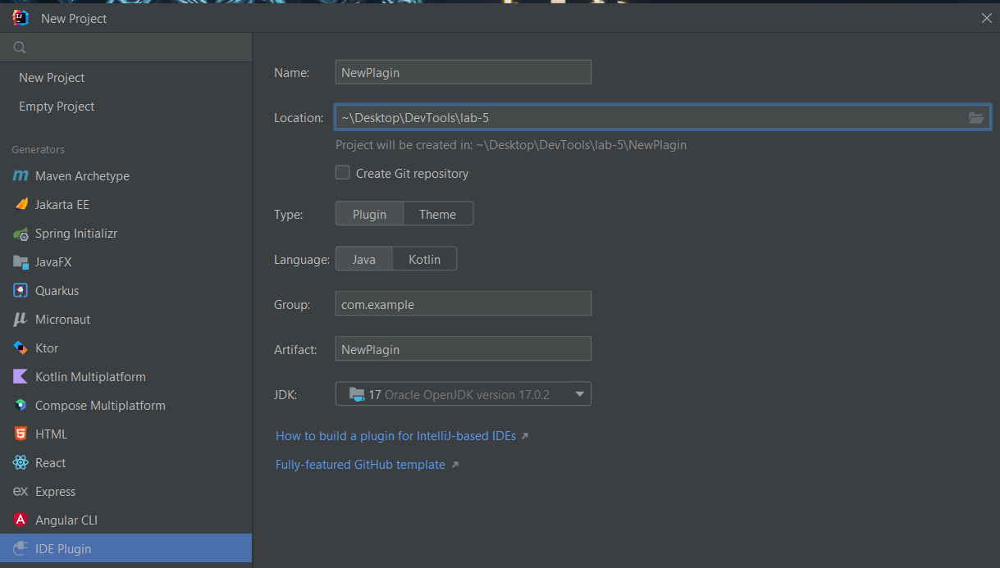
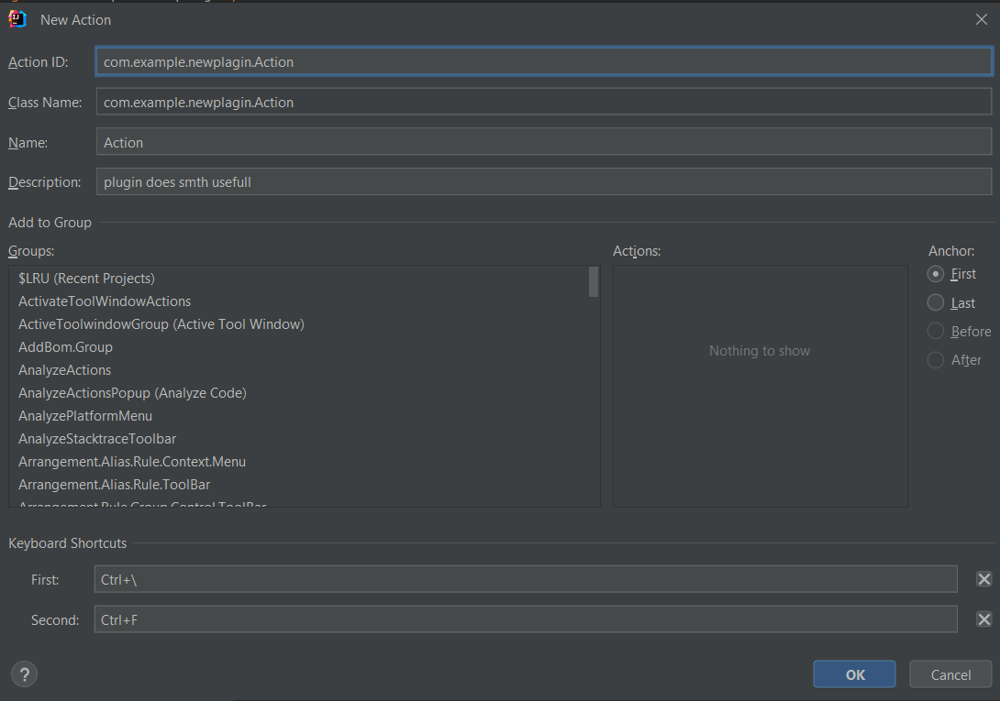
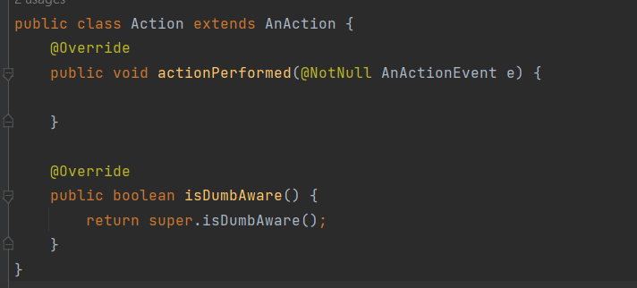
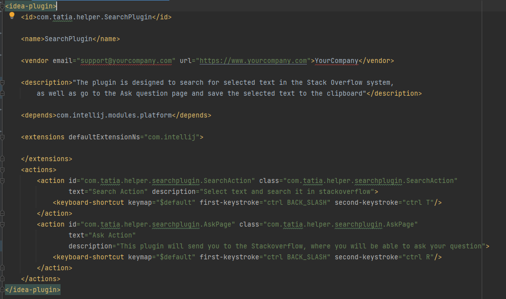

# Search and ask in Stack Overflow plugin
## Golyakova Tatiana M33031
Плагин предназначен для поиска выделенного текста в системе Stack Overflow,
а также перехода на страницу *Ask question* и сохранения выделенного текста в буфер обмена.

Методические указания:
- выделите текст и нажмите сочетание клавиш "Ctrl+\, Ctrl+T", чтобы найти выделенный текст в системе Stack Overflow
- выделите текст и нажмите сочетание клавиш "Ctrl+\, Ctrl+R", чтобы
перейти на страницу *Ask question* и сохранить выделенный текст в буфер обмена

### Процесс создания плагина:

Регистрация действия и назначение горячих клавиш

Java class, в котором поисходит реализация плагина

Файл plugin.xml

